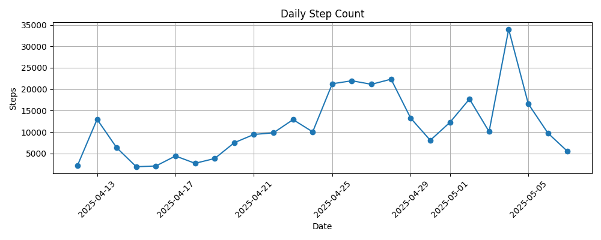
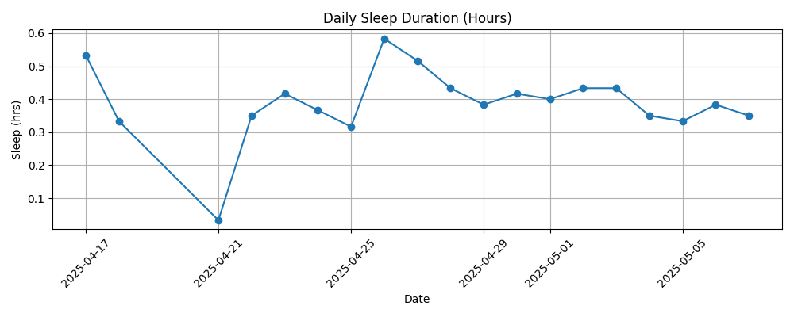
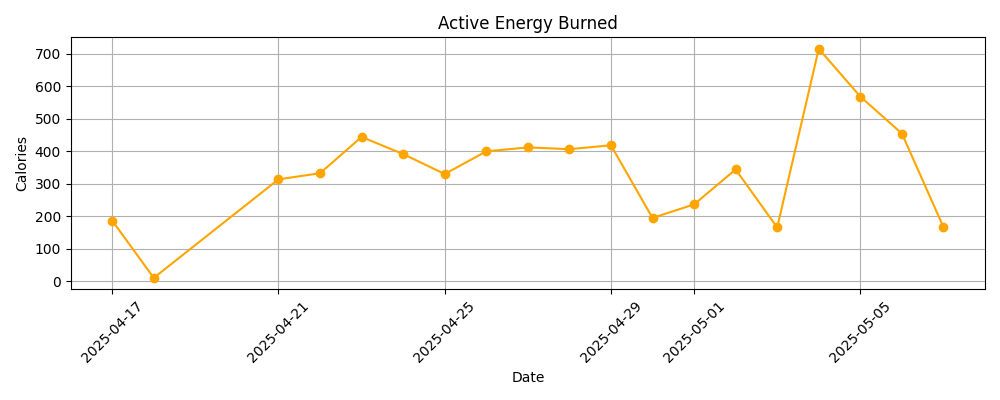

# Apple Health Data Analysis with PySpark
This project processes and analyzes my personal Apple Health data (from iOS export) using PySpark. I extracted step count, active energy, and sleep metrics, and visualized the trends over the past 30 days to see why I my energy went low

## 🔧 Tools Used

- PySpark
- Python (ElementTree for XML parsing)
- Pandas
- Matplotlib
- Jupyter Notebook

## 🧠 This Project Shows

- Real-world use of Spark for time-series health data
- XML to CSV preprocessing
- Data filtering, transformation, and aggregation in PySpark
- Visualizations of step count, calories burned, and sleep trends

## 📊 Example Output

## 📁 Folder Structure

- `/data`: stores raw XML and generated CSV (ignored in Git)
- `/notebooks`: development + visualization notebooks
- `/scripts`: reusable data processing scripts

## 💡 How to Use

1. Export Apple Health data from iPhone
2. Place `export.xml` in `/data`
3. Run `xml_to_csv.py` (or use the notebook)
4. Run the notebook for Spark analysis and charts

## 🗓️ Focused On
- Last 30 days of data
